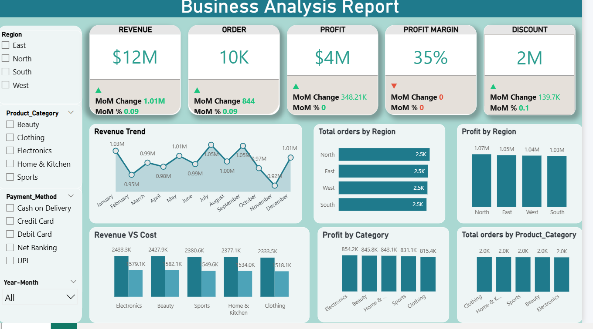

# Business Analysis Report

## Project Summary
This project presents a business analysis report developed to evaluate organizational performance using data-driven techniques. The analysis focuses on sales, revenue, profit, and discount patterns to support informed decision-making.

## Business Problem
Management requires insights into performance trends, profitability, and the impact of discounts across products and time periods.

## Objectives
- Evaluate overall business performance
- Analyze revenue, cost, and profit trends
- Assess the impact of discounts on profitability
- Identify high-performing products and periods

## Tools & Technologies
- Power BI
- Microsoft Excel

## Key Insights
- Sales performance varies significantly across products
- High discount rates negatively affect profit margins
- Certain months record peak sales and profitability

## Dashboard Preview

## Conclusion & Recommendation
The findings highlight the need to optimize discount strategies and focus on high-performing products to improve overall profitability.
